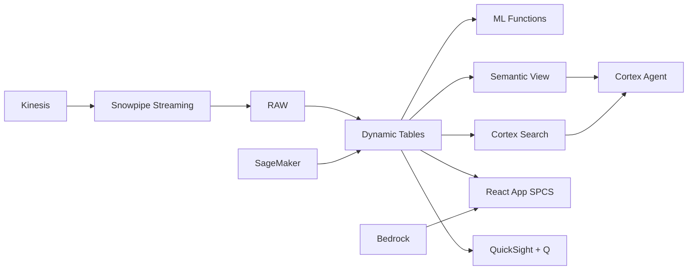

# Digital Islamic Banking

Customer analytics for Indonesia's digital Islamic banking revolution — ML.FORECAST predicts deposit growth, Dynamic Tables build real-time customer 360 views, and Cortex AI generates personalized product recommendations.

## Architecture

Indonesia's 270 million population includes 87% Muslim, yet Islamic banking market share is only 7%. A digital Shariah-compliant neobank has acquired 500,000 customers with 42% annual growth, but must now reduce churn among high-value segments and personalize product recommendations to convert savings customers into full-relationship clients — all while maintaining Shariah compliance.



## Snowflake Capabilities

| Capability | Implementation |
|-----------|---------------|
| Dynamic Tables | CUSTOMER_360 / DEPOSIT_GROWTH_METRICS / CHURN_RISK_SCORE / CAMPAIGN_ROI |
| ML Functions | ML.FORECAST |
| Cortex AI | COMPLETE, SUMMARIZE, AI_CLASSIFY |
| Cortex Search | 40 documents indexed |
| Cortex Agent | DIGITAL_BANKING_AGENT |
| Semantic View | DIGITAL_BANKING_ANALYTICS |
| React App (SPCS) | 5 tabs + DemoGuide |


## AWS Services

| Service | Role in Demo |
|---------|-------------|
| Amazon Kinesis | Stream real-time app events and transactions |
| Amazon Personalize | ML-powered product recommendations |
| AWS Glue | ETL for customer data transformation and feature engineering |
| Amazon SageMaker | Churn prediction and customer segmentation models |
| Amazon Bedrock (Claude) | Generate personalized customer communications |
| Amazon QuickSight + Q | Banking analytics dashboard with natural language |


## Personas

| Persona | Role | Key Questions |
|---------|------|---------------|
| **Andi Rachman** | Chief Digital Officer | "What's our digital customer acquisition rate this month?" "Which segments have the highest deposit growth?" |
| **Nur Aini** | Data Analytics Manager | "Which customers are at risk of churning?" "Show me product penetration by segment." |


## Data

| Table | Rows | Description |
|-------|------|-------------|
| CUSTOMERS | 500,000 | Digital Islamic bank customer profiles with KYC and segmentation |
| TRANSACTIONS | 5,000,000 | 12 months of transaction history across savings, financing, and payments |
| DEPOSITS | 1,000,000 | Daily deposit balances by product type (Wadiah, Mudharabah) |
| APP_EVENTS | 10,000,000 | Mobile app engagement events (logins, feature usage, session data) |
| CAMPAIGNS | 5,000 | Marketing campaign records with targeting and response data |
| PRODUCT_DOCS | 40 | Shariah product documentation, fatwa decisions, and compliance guides |


## Build Instructions

### Prerequisites
- Snowflake account with ACCOUNTADMIN access
- Cortex AI enabled (ML Functions, Search, Agent)
- Warehouse: DIGIBANK_WH (Medium)
- AWS CLI with access (us-west-2)

### Deployment

```bash
snowsql -f snowflake/00_setup.sql
snowsql -f snowflake/01_marketplace_install.sql
snowsql -f snowflake/02_raw_tables.sql
snowsql -f snowflake/03_staging.sql
snowsql -f snowflake/04_dynamic_tables.sql
snowsql -f snowflake/05_search.sql
snowsql -f snowflake/06_ml_models.sql
snowsql -f snowflake/07_semantic_view.sql
snowsql -f snowflake/08_agent.sql
```

### React App (SPCS)
```bash
cd app && npm ci && npm run build
docker build -t aws-indonesia-islamic-finance-digital-app .
docker push bdiqc8sm-default.registry.snowflakecomputing.com/islamic_digital_banking/app/aws_indonesia_islamic_finance_digital/app:latest
```

### Demo Mode
Open the app URL with `?demo=true` for presenter view.

## Build Modes

### Snowflake Only
Run scripts 00-08 (skip AWS-specific integration). Uses:
- **Snowpipe Streaming SDK** instead of Amazon Kinesis
- **ML.FORECAST + Cortex Complete** instead of Amazon Personalize
- **Dynamic Tables** instead of AWS Glue
- **ML.FORECAST** instead of Amazon SageMaker
- **Cortex Complete** instead of Amazon Bedrock (Claude)
- **Snowflake Intelligence (Cortex Analyst)** instead of Amazon QuickSight + Q

### Full AWS + Snowflake
Run all scripts including AWS integration. Deploy QuickSight dashboard from `quicksight/`.

## Business Impact

Industry research and Snowflake customer outcomes:
- **Indonesia's Islamic finance assets reached $120B in 2024 — world's largest Muslim population (275M) drives demand** — [OJK Indonesia](https://www.ojk.go.id/en/kanal/syariah/data-dan-statistik/Pages/Statistik-Perbankan-Syariah.aspx)
- **Islamic fintech transaction volume grew 40% YoY to $3.2B — Alami, Ammana, and LinkAja Syariah leading** — [OJK Fintech Statistics](https://www.ojk.go.id/en/kanal/iknb/data-dan-statistik/fintech/Pages/default.aspx)
- **Digital Islamic banking penetration is only 12% vs 35% for conventional — $50B addressable gap** — [McKinsey Islamic Finance](https://www.mckinsey.com/industries/financial-services/our-insights/islamic-finance)
- **Bank Syariah Indonesia (BSI) — world's 7th largest Islamic bank — invested in digital transformation with cloud analytics** — [BSI Annual Report](https://www.bankbsi.co.id/)
- **Western Union** (Snowflake customer): processes 1B+ cross-border transactions on Snowflake with real-time compliance monitoring across 200+ countries -- [snowflake.com/customers/western-union](https://www.snowflake.com/en/customers/all-customers/case-study/western-union/)

## Key Demo Numbers

- **500,000 customers** digital Islamic banking users (42% YoY growth)
- **Rp 12T deposits** across Wadiah and Mudharabah products
- **8,500 at-risk** high-value customers with elevated churn score
- **10M app events** mobile engagement data points
- **3.2x ROI** Ramadan campaign performance


## License

Apache 2.0 — See [LICENSE](LICENSE) for details.

This is a personal demo project and is not an official Snowflake offering. It comes with no support or warranty.